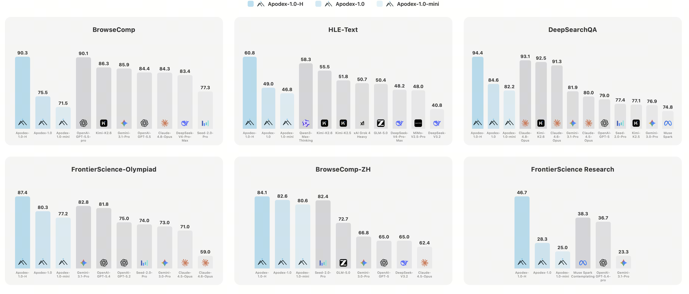

<div align="center">
  <picture>
    
  </picture>
</div>
<hr>
<div align="center" style="line-height:1">
<a href="https://www.apodex.ai" target="_blank"></a>
<a href="https://www.apodex.com/" target="_blank"></a>
<a href="https://platform.apodex.ai" target="_blank"></a>
</div>

<div align="center" style="line-height: 1;">
<a href="https://huggingface.co/collections/apodex" target="_blank"></a>
<a href="https://github.com/ApodexAI" target="_blank"></a>
<a href="https://discord.gg/TDJA59TCng" target="_blank"></a>
<a href="LICENSE"></a>
</div>
<p align="center">
<b>📰<a href="https://www.apodex.com/blog/apodex-1.0">技术博客</a></b> |  <b>📄<a href="http://www.apodex.com/pdf/20260608">技术报告</a></b>
</p>

---

<p align="center">
<strong>简体中文</strong> | <a href="./README.en.md">English</a>
</p>

# AgentHarness

**用于在公开深度研究基准上评测 [Apodex-1.0](https://huggingface.co/apodex/Apodex) 的框架。**

AgentHarness 是一个开源评测框架，用于在标准 **ReAct 配置**下复现 **Apodex-1.0** 的公开基准测试结果。Apodex-1.0 是由 Apodex 团队开发、以验证为核心的深度研究模型。本仓库聚焦于论文所报告的公开标准 ReAct 评测配置。

<p align="center">
  
</p>

---

## 📊 性能表现

Apodex-1.0 各开源变体在四项深度研究基准套件上的表现：

| 模型                | BrowseComp | BrowseComp-ZH | HLE-Text | DeepSearchQA |
| ------------------- | ---------- | ------------- | -------- | ------------ |
| Apodex-1.0-mini     | 71.5       | 80.6          | 46.8     | 82.2         |
| Apodex-1.0-4B-SFT   | 48.8       | 63.5          | 32.9     | 69.9         |
| Apodex-1.0-2B-SFT   | 27.9       | 35.0          | 18.2     | 49.9         |
| Apodex-1.0-0.8B-SFT | 13.9       | 10.7          | 11.2     | 25.8         |

---

## ⚡ 快速开始

### 1. 安装依赖

```bash
uv sync --python 3.12
```

### 2. 使用 SGLang 部署模型

```bash
python3 -m sglang.launch_server \
  --model-path apodex/Apodex-1.0-35B-A3B \
  --tp 8 \
  --host 0.0.0.0 \
  --port 1234 \
  --context-length 262144 \
  --tool-call-parser qwen3_coder \
  --reasoning-parser qwen3 \
```

如需了解更小规模的模型变体及其他部署方式，请参阅 [Hugging Face 模型卡片](https://huggingface.co/collections/apodex/apodex-1)。

### 3. 配置环境变量

```bash
cp .env.example .env
```

在 `.env` 中填写所需密钥：`OPENAI_BASE_URL` / `OPENAI_API_KEY` / `OPENAI_MODEL` 指向智能体模型（可以是第 2 步启动的 SGLang 服务端点，也可以是任意兼容 OpenAI 接口的服务）；`SERPER_API_KEY` / `JINA_API_KEY` / `E2B_API_KEY` 分别用于启用网页搜索、网页抓取和代码沙箱。

### 4. 下载基准数据集

```bash
wget https://huggingface.co/datasets/apodex/Deep-Research-Benchmarks/resolve/main/deep_research_benchmarks_260607.zip
unzip -P 'apodex*()_2026' deep_research_benchmarks_260607.zip
rm deep_research_benchmarks_260607.zip
```

密码两侧必须使用单引号，因为密码中包含 shell 元字符（`*`、`(`、`)`）。

> **下载包不包含 HLE。** 其许可证禁止重新分发答案。如需运行 `hle_text`，请先在 [`cais/hle`](https://huggingface.co/datasets/cais/hle) 接受许可证，然后将 JSONL 文件放置于 `benchmarks/datasets/HLE-text/standardized_data.jsonl`。

### 5. 运行冒烟测试

```bash
uv run python -m benchmarks.runner.run_subprocess \
  --benchmark browsecomp \
  --pipeline react_base \
  --profile default \
  --limit 1 \
  --concurrency 1 \
  --out ./tmp/smoke
```

### 6. 运行完整基准测试

```bash
uv run python -m benchmarks.runner.run_subprocess \
  --benchmark browsecomp \
  --pipeline react_base \
  --profile default \
  --runs 5 \
  --concurrency 30 \
  --out ./bc-runs
```

### 7. 检查进度并汇总准确率

```bash
uv run python -m benchmarks.runner.check_progress ./bc-runs
```

每道问题都在独立子进程中运行，因此测试更易于复现和调试：

* 每道问题相互隔离执行
* 避免 asyncio 饱和
* 可对单个卡死进程发送 `SIGKILL`
* 可独立重新运行失败样本

---

## ✅ 支持的基准

BrowseComp、BrowseComp-ZH、xbench-DeepResearch、Humanity's Last Exam（仅文本）、SuperChem、FrontierScience-Research、FrontierScience-Olympiad、DeepSearchQA、WideSearch

有关数据集目录结构、评判器配置以及如何添加新基准，请参阅 [`benchmarks/README.md`](benchmarks/README.md)。

---

## ⭐ Star 历史

<a href="https://star-history.com/#ApodexAI/AgentHarness&Date">
  <picture>
    <source media="(prefers-color-scheme: dark)" srcset="https://api.star-history.com/svg?repos=ApodexAI/AgentHarness&type=Date&theme=dark" />
    <source media="(prefers-color-scheme: light)" srcset="https://api.star-history.com/svg?repos=ApodexAI/AgentHarness&type=Date" />
    
  </picture>
</a>

---

## 📚 引用

```bibtex
@techreport{apodex2026,
  title  = {Apodex-1.0: A Verification-Centric Agent Team for Discoverative Intelligence},
  author = {Apodex Team},
  year   = {2026}
}
```

---

## 📄 许可证

本项目采用 Apache 2.0 许可证，详情请参阅 [LICENSE](./LICENSE)。
